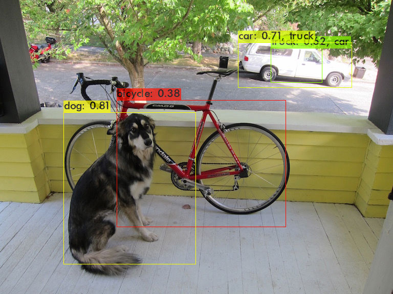

## Report file for Laboratory 1 Assignment
### Completed by: Nishanth Marer Prabhu and Jiahua Liu

## Issue 2:
1. The darknet module was compiled successfully using the gcc/11.1.0 and cmake 3.27.9.
2. Weights for the tiny yolov3 was pulled and the execution was done
3. Resulting Image:

      

4. The output of the dog.txt is as follows:

      

## Issue 3:
1. The Makefile of the darknet was modified to include the *-pg* switch for enabling the profilier mode.
2. Generated the darknet-perf.txt. Here is the snap shot of the main function who's runtime was the bottle neck.

      

3. We also performed the profiling on the Zedboard and we observe that the performance is slightly worse compared to the host machine.

      
>[!NOTE]
>We should remember that in this case we use the standard naive matrix multiplier with no optimization therefore it is clear that there will a slow down of performance in the Zedboard.
## Issue 4:
1. The matrix mutltiplication function in the gemm.c with no transpose function was used, and testdata.cpp content was used for verifying the output of the function.
2. The resultant of the matrxi multiplication was compared with the given Cout data in the testdata.cpp and the SNR was calculated on them.
3. Resulting SNR:

      

4. We defined the functions *mm_float_to_fixed* and *mm_fixed_to_float* for converting the data between fixed and floating point.
5. We used multiple datatypes for testing and achieved highest with the **int64_t** datatype. (Since it has more bits it is able to maintain the SNR value).
6. We also tested with the int16_t, int32_t and tried to estimate the scaling values for the highest possible SNR achievable.

   

## Issue 5:
1. Here we created the branch **gemm_fp_cpu** for the darknet repository and started to modify the gemm.c file.
2. In this file we observed that the gemm_nn function was called for performing the matrix multiplications.
3. We replaced this function with the fixed point gemm code and also added the conversion functions.
4. We made the roundup function inline for giving better performance.
5. Running the mAP estimate we determined the mAP value for the fixed point gemm using the int32_t datatype/
6. The results are below:

      

7. Further we investigated by adding the **#pragma omp parallel for** for the fixed matrix multiplier function and obtained the run time below:

      

8. We then performed profiling on the fixed point gemm function to determine the run time.
9. We observe a drop in performance. This is expected because, as an overhead we have added an additional three loops. One for fixed to floating, one for floating to fixed and the last for initializing the C matrix for the integer calculations.
10. This overhead adds to the time taken for the fixed point gemm function to calculate the output.

       

11. Coming back the original code, we will observe the difference in performance of the gemm function and run time of the code.

      

      

12. In terms of the runtime of the code, we see that the fixed point gemm takes 3.5x times more than the floating point gemm function.
13. Similarly, the gemm_nn function in particular takes 14.56 unit time more than the floating point gemm. (This is delay is mainly due to the added due to the extra loops added into the function).

14. Now coming to the mAP values for the floating piint, we see that the F1 score is 0.80 and it is able to recognise and classify all four of the objects present in the image.

       

15. The mAP for the fixed point gemm, we see a drop in the F1 score to 0.67. This is to be expected because of the conversion to fixed point, where some of the precision is lost.

       

16. The darknet repo contains the gemm_fp_cpu branch

## Issue 6:
1. We modified one of the gemm_nn function which uses the intrinsic functions for performing matrix multiplication. 
2. We added the floating to fixed point conversion function and vice function.
3. The AVX (Advanced Vector Extensions) lead to a drastic reduction in the runtime of the code.
4. Result of execution:

      
5. We can see that the compared to the regular fixed gemm function, the drop in milliseconds is significant.
      Fixed point gemm (original) = 2261 ms
      Fixed point gemm (SIMD) = 281 ms
      Drop in execution time = -1980 ms
For better optimization, the complete code may need refactoring as it is heavily tied down to floating point execution. However, a change to fixed point will help in reducing the execution time.
